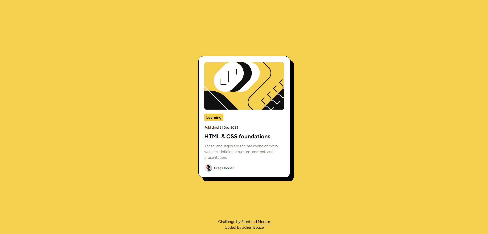
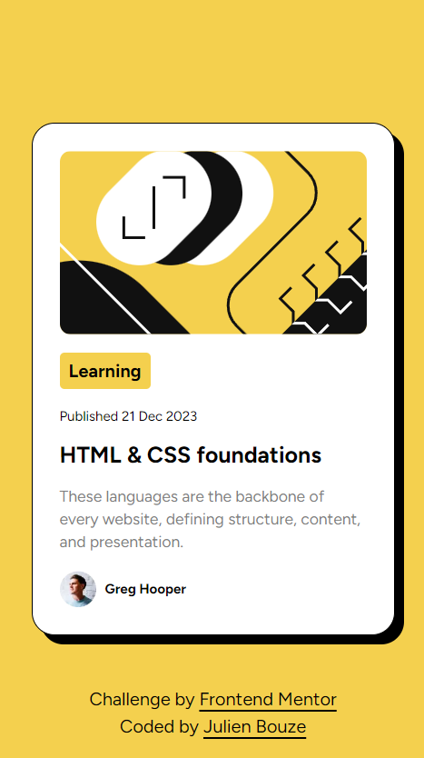

# Frontend Mentor - Blog preview card solution

This is a solution to the [Blog preview card challenge on Frontend Mentor](https://www.frontendmentor.io/challenges/blog-preview-card-ckPaj01IcS). Frontend Mentor challenges help you improve your coding skills by building realistic projects. 

## Table of contents

- [Overview](#overview)
  - [The challenge](#the-challenge)
  - [Screenshot](#screenshot)
  - [Links](#links)
- [My process](#my-process)
  - [Built with](#built-with)
  - [What I learned](#what-i-learned)
  - [Continued development](#continued-development)
  - [Useful resources](#useful-resources)
- [Author](#author)

## Overview

### The challenge

Users should be able to:

- Add items to the cart and remove them
- Increase/decrease the number of items in the cart
- See an order confirmation modal when they click "Confirm Order"
- Reset their selections when they click "Start New Order"
- View the optimal layout for the interface depending on their device's screen size
- See hover and focus states for all interactive elements on the page

### Screenshot
#### Desktop

#### Mobile

### Links

- Solution URL: [GitHub Repo](https://github.com/julienbouze/blog-preview-card)
- Live Site URL: [Vercel Demo](https://blog-preview-card-xi-lovat.vercel.app/)

## My process

### Built with

- Semantic HTML5 markup
- CSS custom properties
- Flexbox
- CSS Grid
- Mobile-first workflow
- [React](https://reactjs.org/) - JS library
- [Next.js](https://nextjs.org/) - React framework
- [Tailwind CSS](https://tailwindcss.com/) - CSS Framework

### What I learned

I learned the use of box shadows

### Continued development

I want to keep improving my Tailwind skills. I want to be able to create any website without editing CSS directly.

### Useful resources

- [Tailwind shadow documentation](https://tailwindcss.com/docs/box-shadow) - This helped me to discover how to use shadows with Tailwind.

## Author

- Github - [@julienbouze](https://github.com/julienbouze)
- Frontend Mentor - [@julienbouze](https://www.frontendmentor.io/profile/julienbouze)
